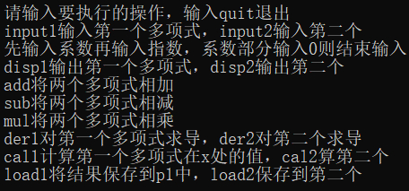
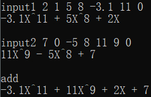
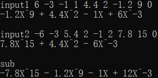
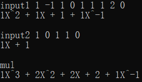
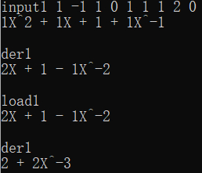
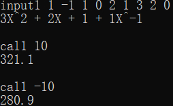

# Project1 实验报告

<p align="right">21307077  
<p align="right">凌国明 

## 程序功能说明
1. 通过逐项输入系数和指数输入多项式，对输入顺序不作要求
2. 输出多项式，序列按指数降序排序
3. 实现多项式 **$a$** 和多项式 **$b$** 的相加，输出多项式 **$a+b$**
4. 实现多项式 **$a$** 和多项式 **$b$** 的相减，输出多项式 **$a-b$**
5. 实现多项式 **$a$** 和多项式 **$b$** 的相乘，输出多项式 **$a*b$**
6. 计算多项式 **$a$** 在 **$x$** 处的值
7. 计算多项式 **$a$** 的导函数 **$a'$**
   
## 程序运行展示

### 指令集
<div  align="center">    

</div>

### 测试样例1  加法
<div  align="center">    

</div>

### 测试样例2  减法
<div  align="center">    

</div>

### 测试样例3  乘法
<div  align="center">    

</div>

### 测试样例4  求导
<div  align="center">    

</div>

### 测试样例5  求值
<div  align="center">    

</div>

## 部分关键代码及其说明
### 输入多项式
```c++
void Polynomial::input(){
	clear();
	double coef, expo;
	while(cin >> coef){
		if(coef == 0)
			break;
		cin >> expo; 
		insert(coef, expo);
	}
	return;
}

bool Polynomial::insert(double coef, double expo){
	Node *p = head, *q = head->next;
	bool add_or_not = true;
	while(q != NULL){
		if(p->expo > expo && q->expo < expo){
			add_or_not = true;
			break;
		}
		if(q->expo == expo){
			add_or_not = false;
			break;
		}
		q = q->next;
		p = p->next;
	}
	if(add_or_not){
		Node *tmp = new Node(coef, expo, q);
		p->next = tmp;
	}
	else{
		q->coef += coef;
		if(q->coef == 0)
			p->next = q->next;
	}
	return true;
}
```
系数和指数成对输入，输入顺序可以不按指数升序或降序排序，输入后会**自动插入**到链表的**合适位置**。

### 多项式加减法
```c++
Polynomial add_sub(const Polynomial& a, const Polynomial& b, int mod){
	Polynomial res;
	Node *tmp = res.head;
	Node *tmp1 = a.head->next;
	Node *tmp2 = b.head->next;	
	while(tmp1 != NULL && tmp2 != NULL){
		if(tmp1->expo == tmp2->expo){
			if(tmp1->coef + mod * tmp2->coef != 0){
			tmp->next = new Node(tmp1->coef + mod * tmp2->coef, tmp1->expo);
			tmp = tmp->next;
			tmp1 = tmp1->next;
			tmp2 = tmp2->next;
			}
			else{
				tmp1 = tmp1->next;
				tmp2 = tmp2->next;
			}
		}
		else if(tmp1->expo > tmp2->expo){
			tmp->next = new Node(tmp1->coef, tmp1->expo);
			tmp = tmp->next;
			tmp1 = tmp1->next;
		}
		else if(tmp1->expo < tmp2->expo){
			tmp->next = new Node(mod * tmp2->coef, tmp2->expo);
			tmp = tmp->next;
			tmp2 = tmp2->next;
		}
	}
	while(tmp1 != NULL){
		tmp->next = new Node(tmp1->coef, tmp1->expo);
		tmp = tmp->next;
		tmp1 = tmp1->next;
	}
	while(tmp2 != NULL){
		tmp->next = new Node(mod * tmp2->coef, tmp2->expo);
		tmp = tmp->next;
		tmp2 = tmp2->next;
	}
	return res;
}
```
加法和减法用同一个函数实现，当 **$mod == 1$** 时是加法，**$mod == -1$** 时是减法。

### 多项式乘法
```c++
Polynomial mul(const Polynomial& a, const Polynomial& b){
	Polynomial res;
	Polynomial *tmp_res = new Polynomial[a.size() ];
	Node *tmp1 = a.head, *tmp2 = b.head, *tmp; 
	for(int i = 0; i < a.size(); i++){
		tmp1 = tmp1->next;
		tmp2 = b.head;
		tmp = tmp_res[i].head;
		for(int j = 0; j < b.size(); j++){
			tmp2 = tmp2->next;		
			tmp->next = new Node(tmp1->coef * tmp2->coef, tmp1->expo + tmp2->expo);
			tmp = tmp->next;
		}
		res = add_sub(res, tmp_res[i], 1);
	}
	return res;
}
```
先用 **$a$** 的每一项乘以 **$b$** ，然后再求和。

### 多项式求导
```c++
Polynomial Polynomial::der(){
	Polynomial res;
	Node *tmp = head->next;
	Node *tmp2 = res.head;
	while(tmp != NULL){
		if(tmp->expo == 0){
			tmp = tmp->next;
		}
		else{
			tmp2->next = new Node(tmp->coef * tmp->expo, tmp->expo-1);
			tmp = tmp->next;
			tmp2 = tmp2->next;
		}
	}
	return res;
}
```

### 多项式求值
```c++
double Polynomial::caculate(const double x){
	double ans = 0;
	Node *tmp = head->next;
	while(tmp != NULL){
		ans += tmp->coef * pow(x, tmp->expo);
		tmp = tmp->next;
	}
	return ans;
}
```

## 程序运行方式简要说明
```c++
struct Node{
	double coef; //系数 
	double expo; //指数
	Node* next; 
	//构造函数 
	Node(): coef(0), expo(99999), next(NULL){}
	Node(double coef, double expo): coef(coef), expo(expo), next(NULL){}
	Node(double coef, double expo, Node* next): coef(coef), expo(expo), next(next){}
};

class Polynomial{
	private:
		Node* head;
	public:
		//构造函数 
		Polynomial();
		Polynomial(const Polynomial& p);
		//析构函数
		~Polynomial();
		//深拷贝赋值
		Polynomial operator = (const Polynomial& p); 
		//清除多项式
		void clear();
		//输入多项式
		void input(); 
		//链表插入元素
		bool insert(double coef, double expo); 
		//输出多项式
		void display(); 
		//多项式项数
		int size() const; 
		
		//加或减操作 
		friend Polynomial add_sub(const Polynomial& a, const Polynomial& b, int mod);
		//乘操作 
		friend Polynomial mul(const Polynomial& a, const Polynomial& b);
		//计算多项式在x处的值 
		double caculate(const double x);
		//多项式求导
		Polynomial der();	
};
```

### 数据结构
多项式使用线性表实现，用带头节点的单向链表进行存储

### 数据输入
输入顺序可以任意，但系数指数要成对输入，输入系数为 **$0$** 时停止输入。输入后 **$insert()$** 函数会将该节点插入到合适的位置中，如果已有该指数的节点存在，则不新增节点，将系数加到该节点的系数上。

### 多项式乘法
先用多项式 **$a$** 的每一项与 **$b$** 的结果相乘，最后将相乘得到的所有结果进行求和。

### 指令输入
<div  align="center">    

</div>