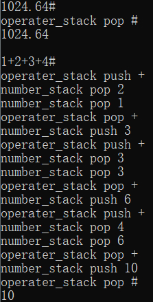
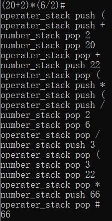
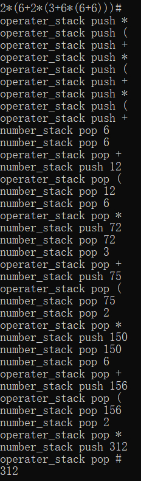
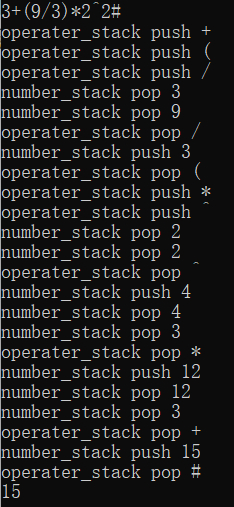
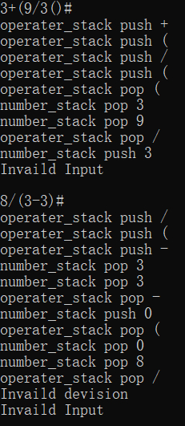

# Project1 实验报告

<p align="right">21307077  
<p align="right">凌国明 

## 程序功能说明
1. 输入不含变量的整数/浮点数表达式
2. 实现对算术混合运算表达式的求值
3. 额外实现了乘方功能
   
## 程序运行展示

### 输入数字及加法
<div  align="center">    

</div>

### 混合运算展示1
<div  align="center">    

</div>

### 混合运算展示2
<div  align="center">    

</div>

### 混合运算展示3
<div  align="center">    

</div>

### 错误处理展示
<div  align="center">    

</div>


## 部分关键代码及其说明
### 输入数字
```c++
if(isdigit(s[i])){
    if(digit_flag && !point_flag){
        tmp = num_stack.top();
        num_stack.pop();
        tmp *= 10;
        tmp += s[i] - '0';
        num_stack.push(tmp);
    }
    else if(digit_flag && point_flag){
        tmp = num_stack.top();
        num_stack.pop();
        tmp += (s[i]-'0') * pow(10, -flag);
        flag++;
        num_stack.push(tmp);
    }
    else{
        num_stack.push(s[i] - '0');
    }
    digit_flag = true;
}
else if(s[i] == '.'){
    point_flag = true;
    digit_flag = true;
    flag = 1;
}
```
用 **$bool$** 型变量 **$digit\_flag$** 记录上个读入的字符是否为数字，用 **$bool$** 型变量 **$point\_flag$** 记录次数字是否为小数。

### 输入操作符
```c++
digit_flag = false;
point_flag = false;
flag = ope.find(s[i]);
if(flag >= 0 && flag < 8){
    label: flag_1 = ope.find(op_stack.top() );
    if(compare[flag_1][flag] == 0){
        cout << "operater_stack pop " << op_stack.top() << endl;
        op_stack.pop();
    }
    else if(compare[flag_1][flag] == -1){
        op_stack.push(s[i]);
        cout << "operater_stack push " << op_stack.top() << endl;
    }
    else if(compare[flag_1][flag] == 1){
        tmp = num_stack.top();
        num_stack.pop();
        cout << "number_stack pop " << tmp << endl;
        cout << "number_stack pop " << num_stack.top() << endl;
        cout << "operater_stack pop " << op_stack.top() << endl;
        if(op_stack.top() == '+'){
            tmp += num_stack.top();
            num_stack.pop();
            num_stack.push(tmp);
        }
        else if(op_stack.top() == '-'){
            tmp = num_stack.top() - tmp;
            num_stack.pop();
            num_stack.push(tmp);
        }
        else if(op_stack.top() == '*'){
            tmp *= num_stack.top();
            num_stack.pop();
            num_stack.push(tmp);
        }
        else if(op_stack.top() == '/'){
            if(tmp == 0){
                cout << "Invaild devision" << endl;
                break;
            }
            tmp = num_stack.top() / tmp;
            num_stack.pop();
            num_stack.push(tmp);
        }
        else if(op_stack.top() == '^'){
            tmp = pow(num_stack.top(), tmp);
            num_stack.pop();
            num_stack.push(tmp);
        }
        cout << "number_stack push " << num_stack.top() << endl;
        op_stack.pop();
        goto label;
    }
}
```

## 程序运行方式简要说明
1. 输入数字时根据 **$bool$** 型变量 **$digit\_flag$** 和 **$point\_flag$** 读入浮点数，上方有代码说明。
2. 输入操作符时根据优先级进行一系列 **$push$** 和 **$pop$** 的操作
3. 当操作符比较优先级时可以发现表达式的语法错误，如发现 **$")"$** 在 **$"("$** 前的情况，此时要报错并清空两个栈，以准备下次输入。