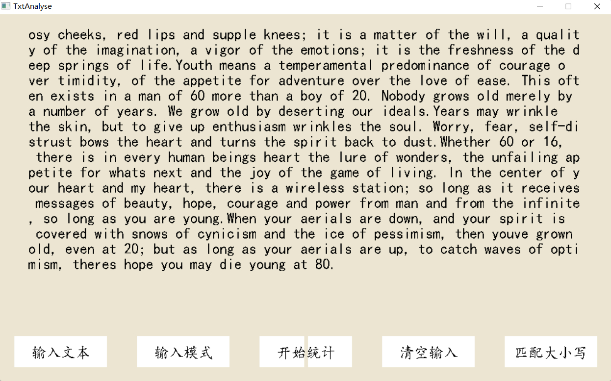
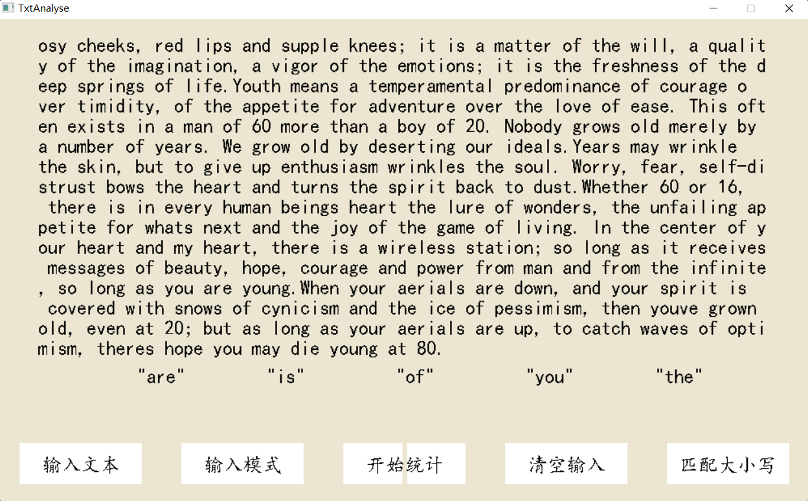
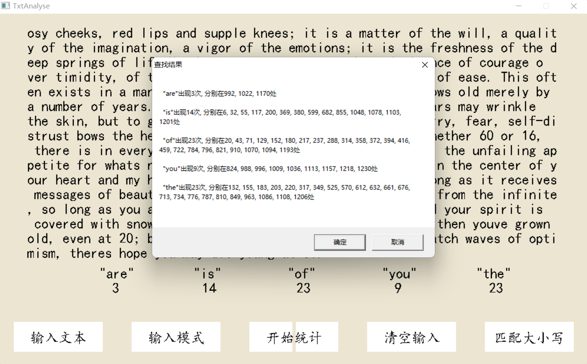
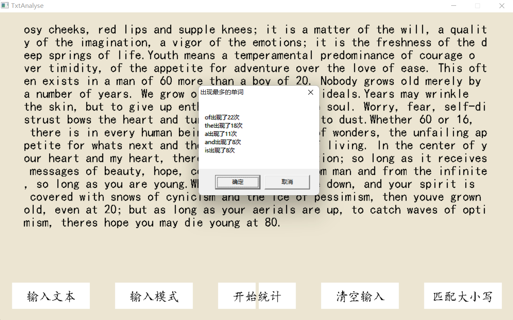
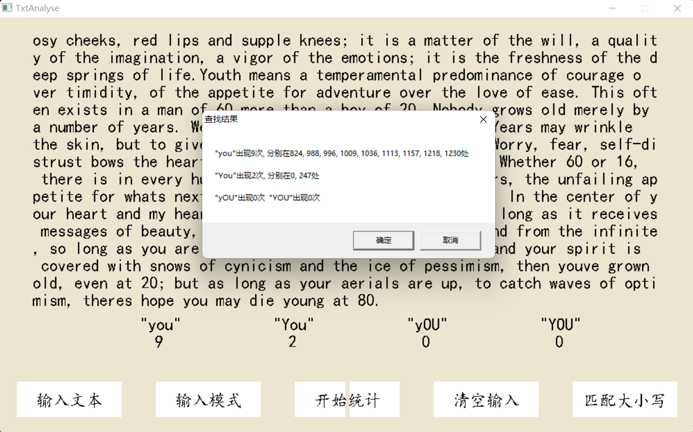
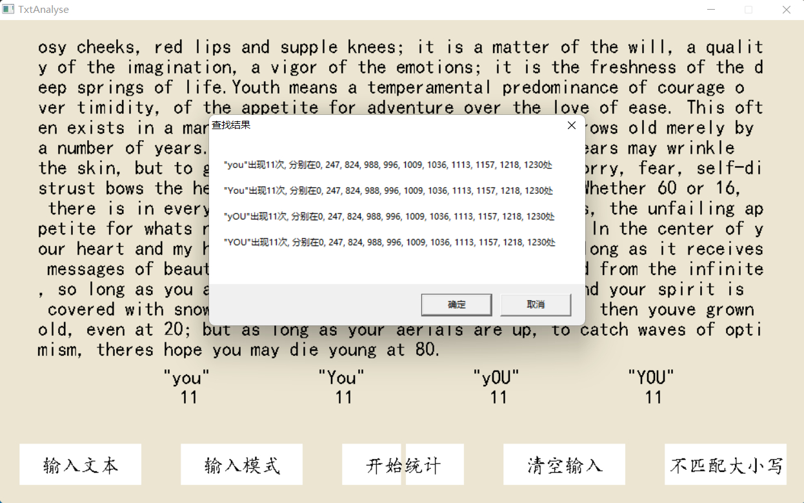

# Project3 实验报告

<p align="right">21307077  
<p align="right">凌国明 

## 程序功能说明
1. 实时输入文本串，并在图形化窗口中显示出来。输入的文本串可以不用换行。可以按 **$delete$** 键删除字符。在窗口展示时，如果文本串过长，则仅展示文本串中的最后 **$15 * 75$** 个字符。
2. 输入模式串，可以输入多个长度不同的串，可以用 **$delete$** 键删除字符或模式串。
3. 利用 **$KMP$** 算法在文本串中查找模式串，并展示出现次数，出现位置等查找结果。
4. 对整个文本串进行统计，展示出现频率最高的 **$k$** 个单词及其出现次数。
5. 清空输入，以便进行下次的输入和统计。
6. 查找模式串时的大小写匹配功能，打开时，查找对大小写敏感，关闭时，对大小写不敏感。
   
## 程序运行展示

### 输入文本串
<div  align="center">    

</div>

图中文本串过长，于是仅展示了文本串中的最后 **$15 * 75$** 个字符。
可通过 **$delete$** 键逐个删除字符，直到文本串为空。

### 输入模式串
<div  align="center">    

</div>

可以通过 **$delete$** 键删除模式串中的字符，模式串为空时 **$delete$** 则删除此模式串。点击 “输入模式” 新增模式串。

### 查找模式串
<div  align="center">    

</div>

### 文本统计
<div  align="center">    

</div>

### 大小写匹配
#### 开启大小写匹配时
<div  align="center">    

</div>

#### 关闭大小写匹配时
<div  align="center">    

</div>


## 部分关键代码及其说明
### 输入文本串
```c++
char ch;
ch = _getch();
switch(ch){
    case DELETe:
        if(!TXT.empty() )
            TXT = TXT.erase(TXT.size()-1, 1);
        break;
    default:
        TXT += ch;
        break;
}
```
文本通过一个 **$string$** 变量存储。可通过 **$delete$** 键逐个删除字符，直到文本串为空。

### 输入模式串
```c++
char ch;
ch = _getch();
if(Pat_Counter < 0)
    Pat_Counter = 0;
switch(ch){
    case DELETe:
        if(!PAT[Pat_Counter].empty() )
            PAT[Pat_Counter] = PAT[Pat_Counter].erase(PAT[Pat_Counter].size()-1, 1);
        else{
            if(Pat_Counter >= 0)
                Pat_Counter--;
        }
        break;
    default:
        PAT[Pat_Counter] += ch;
        break;
}
```

### KMP查找算法
#### 二维next数组：有限状态自动机
```c++
void initialize(string pat, int mode = 0){
    this->pat = pat;
    int M = pat.size();
    if(mode == 0){
        // 初始化dp 
        this->dp = new int*[M];
        for(int j = 0; j < M; j++){
            dp[j] = new int[256];
            for(int c = 0; c < 256; c++){
                dp[j][c] = 0;
            }
        }
        // 影子状态
        int X = 0; 
        // 构造dp数组 
        dp[0][pat[0]] = 1;
        // j为当前状态，c为字符 
        for(int j = 1; j < M; j++){
            for(int c = 0; c < 256; c++){
                if(c == pat[j]){
                    dp[j][c] = j + 1;
                }
                else{
                    dp[j][c] = dp[X][c];
                }
            }
            // 更新影子状态 
            X = dp[X][pat[j] ];
        }
    }
    
    else{
        // 初始化dp
        this->dp = new int*[M];
        for(int j = 0; j < M; j++){
            dp[j] = new int[256];
            for(int c = 0; c < 256; c++){
                dp[j][c] = 0;
            }
        }
        // 影子状态
        int X = 0; 
        // 构造dp数组 
        dp[0][pat[0]] = 1;
        if(isupper(pat[0]) ){
            dp[0][pat[0] - 'A' + 'a'] = 1;
        } 
        else if(islower(pat[0]) ){
            dp[0][pat[0] - 'a' + 'A'] = 1;
        }
        // j为当前状态，c为字符
        bool flag = false; // 不匹配大小写 
        int cc = -1;
        for(int j = 1; j < M; j++){
            flag = false;
            for(int c = 0; c < 256; c++){
                if(c == pat[j]){
                    dp[j][c] = j + 1;
                    if(isupper(c ) ){
                        cc =  c - 'A' + 'a';
                        dp[j][c - 'A' + 'a'] = j+1;
                        flag = true;
                    } 
                    else if(islower(c ) ){
                        cc = c - 'a' + 'A';
                        dp[j][c - 'a' + 'A'] = j+1;
                        flag = true;
                    }
                }
                else if(flag && c == cc){
                    continue; // 大小写不敏感 
                }
                else{
                    dp[j][c] = dp[X][c];
                }
            }
            // 更新影子状态 
            X = dp[X][pat[j] ];
        }
    }
}
```
**$mode$** 为 **$0$** 时匹配大小写，否则不匹配。通过二维的 **$dp$** 数组构造**有限状态自动机**，以实现查找模式串的状态转移。

#### 查找函数
```c++
vector<int> search(const string& txt){
    vector<int> ans;
    APPEAR_NUM = 0;
    int M = pat.size();
    int N = txt.size();
    
    int j = 0;
    for(int i = 0; i < N; i++){
        j = dp[j][txt[i] ];
        if(j == M){
            APPEAR_NUM++;
            ans.push_back(i - j + 1);
            j = 0;
        }
    }
    return ans;
}
```

## 程序运行方式简要说明
1. 通过 **$EasyX$** 库开发图形化交互界面，用于文本串，模式串及统计结果的展示。
2. 点击界面上的按钮，从各个功能中切换。如点击 “输入文本” 按钮时，可以对文本串进行编辑。点击 “开始统计” 时，弹出窗口展示统计结果。
3. 点击 “大小写匹配” 按钮时，查找方式在 “匹配大小写” 和 “不匹配大小写” 之间切换，这会影响 **$KMP$** 算法中模式串 **$next$** 数组的初始化。
4. 查找模式串时，先针对模式串计算 **$next$** 数组，然后查找，返回出现次数和出现位置。
5. 统计文本时，利用 **$map$** 遍历文本中的单词，通过 **$<string, int>$** 的键值对完成统计，最后弹出窗口打印结果。