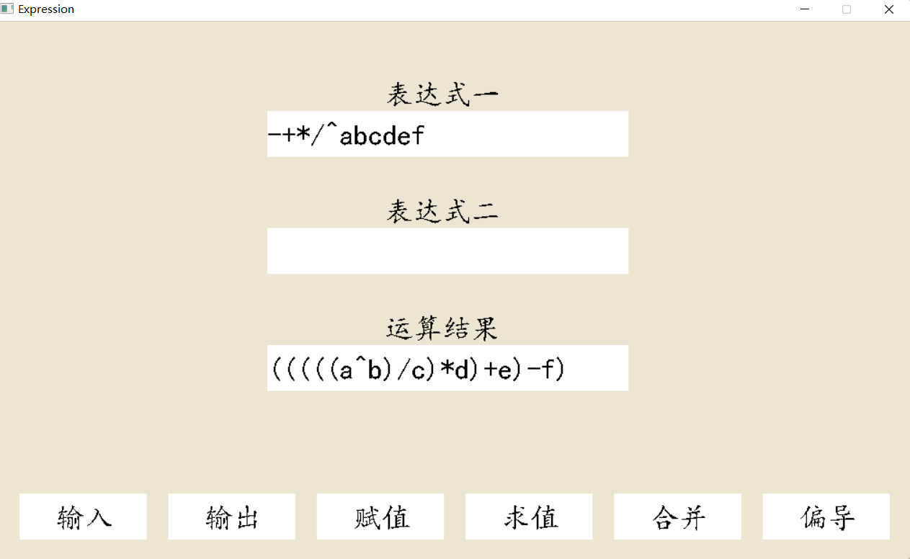
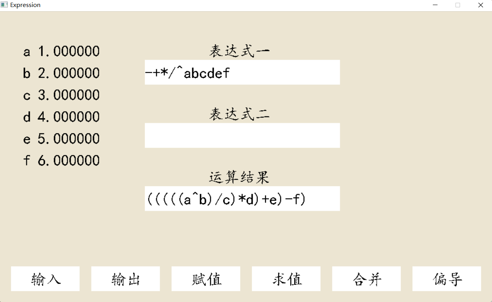
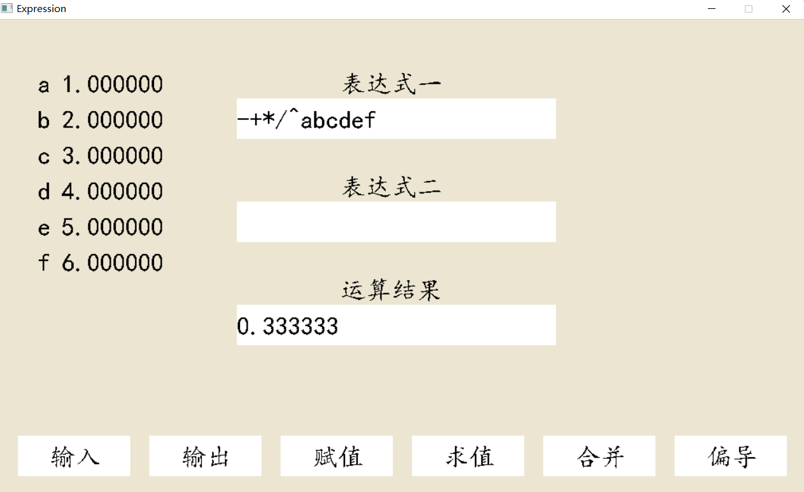
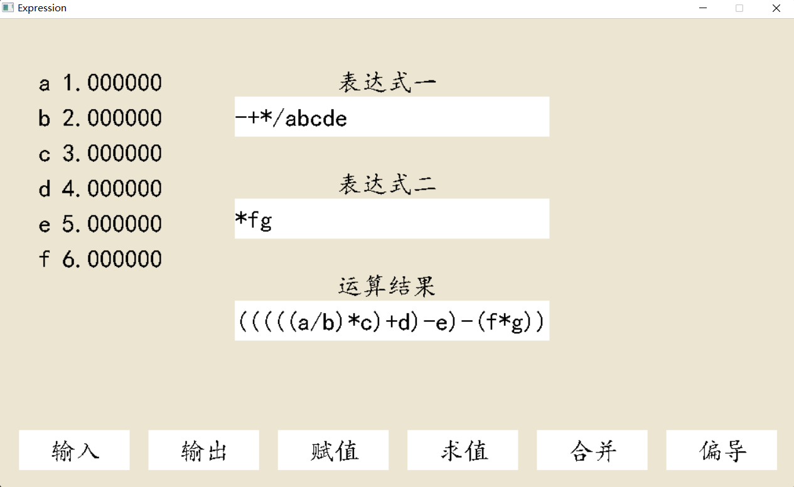

# Project4 实验报告

<p align="right">21307077  
<p align="right">凌国明 

## 程序功能说明
1. 以字符序列的形式输入语法正确的前缀表达式并构成表达式 **$ E $**, 表达式可由变量 **$ a-z ， A-Z $** 和常量 **$ 0-9 $**， 二元运算符 + - * / ^ 构成。支持浮点数的读入。
2. 前缀表达式转成中缀表达式，并用带括弧的中缀表示式输出表达式 **$ E $**。
3. 实现对变量 V 的赋值(V = c)，变量的初值为 0。
4. 对算术表达式 E 求值。
5. 合并 **$ E1 $** 与 **$ E2 $** 以构成一个新的复合表达式 **$ (E1)P(E2) $**。
   
## 程序运行展示

### 输入输出表达式
<div  align="center">    

</div>

可以实时输入表达式，表达式非空时，按 **$ delete $** 键可删除表达式的最后一个字符。

### 变量赋值
<div  align="center">    

</div>

按下 “赋值” 按钮后，输入变量，再输入对应的值，按下 **$ enter $** 即可完成赋值。支持浮点数的读入。未赋值变量默认为 **$ 0 $**。

### 计算表达式的值
<div  align="center">    

</div>

### 合并
<div  align="center">    

</div>
按下 “输入” 按钮的右半部分，即可输入表达式二。输入完毕后，点击 “合并” 按钮，并输入对应的二元运算符，即可完成合并。


## 部分关键代码及其说明
### 输入文本串
```c++
char ch;
ch = _getch();
switch(ch){
    case DELETe:
        if(!TXT.empty() )
            TXT = TXT.erase(TXT.size()-1, 1);
        break;
    default:
        TXT += ch;
        break;
}
```
文本通过一个 **$string$** 变量存储。可通过 **$delete$** 键逐个删除字符，直到文本串为空。

### 前缀表达式转中缀表达式
```c++
string WriteExpr(){
    string MidOrder = expr;
    string str1, str2;
    double tmp;
    stack<double> num_sta;
    stack<string> str_sta;
    bool digit_flag = false;
    int weishu = 1;
    for(int i = expr.size()-1; i >= 0; i--){
        if(isalpha(expr[i]) ){
            if(digit_flag){
                tmp = num_sta.top();
                num_sta.pop();
                str_sta.push(to_string(tmp) );
            }
            digit_flag = false;
            str_sta.push(string(1, expr[i]) );
        }
        else if(expr[i] == ' '){
            if(digit_flag){
                tmp = num_sta.top();
                num_sta.pop();
                str_sta.push(to_string(tmp) );
            }
            digit_flag = false;
            weishu = 1;
        }
        else if(expr[i] == '.'){
            digit_flag = true;
            tmp = num_sta.top();
            num_sta.pop();
            tmp *= pow(10, -weishu);
            num_sta.push(tmp);
            weishu = 0;
        }
        else if(isdigit(expr[i]) ){
            if(!digit_flag)
                num_sta.push(expr[i] - '0');
            else{
                tmp = num_sta.top();
                num_sta.pop();
                tmp += (int)pow(10, weishu++) * (expr[i] - '0');
                num_sta.push(tmp);
            }
            cout << num_sta.top() << endl;
            digit_flag = true;
        }
        else{
            if(digit_flag){
                tmp = num_sta.top();
                num_sta.pop();
                str_sta.push(to_string(tmp) );
            }
            digit_flag = false;
            weishu = 1;
            if(str_sta.empty() )
                return "";
            str1 = str_sta.top();
            str_sta.pop();
            if(str_sta.empty() )
                return "";
            str2 = str_sta.top();
            str_sta.pop();
            if(expr[i] == '+'){
                str_sta.push(string("(") + str1 + string("+") + str2 + (")") );
            }
            else if(expr[i] == '-'){
                str_sta.push(string("(") + str1 + string("-") + str2 + (")") );
            }
            else if(expr[i] == '*'){
                str_sta.push(string("(") + str1 + string("*") + str2 + (")") );
            }
            else if(expr[i] == '/'){
                str_sta.push(string("(") + str1 + string("/") + str2 + (")") );
            }
            else if(expr[i] == '^'){
                str_sta.push(string("(") + str1 + string("^") + str2 + (")") );
            }
        }
    }
    return str_sta.top();
}
```
从后往前遍历表达式，遇到数字时将数字压栈（可对多位整数或浮点数压栈），遇到变量时将变量压栈。遇到二元运算符时从栈中弹出两个操作数并进行字符串操作，以实现中缀表达式的转换。

### 表达式求值
```c++
double value(){
    double num1, num2, tmp;
    stack<double> num_sta;
    bool digit_flag = false;
    int weishu = 1;
    for(int i = expr.size()-1; i >= 0; i--){
        if(isalpha(expr[i]) ){
            num_sta.push(val[expr[i]] );
        }
        else if(expr[i] == ' '){
            digit_flag = false;
            weishu = 1;
        }
        else if(expr[i] == '.'){
            digit_flag = true;
            tmp = num_sta.top();
            num_sta.pop();
            tmp *= pow(10, -weishu);
            num_sta.push(tmp);
            weishu = 0;
        }
        else if(isdigit(expr[i]) ){
            if(!digit_flag)
                num_sta.push(expr[i] - '0');
            else{
                tmp = num_sta.top();
                num_sta.pop();
                tmp += (int)pow(10, weishu++) * (expr[i] - '0');
                num_sta.push(tmp);
            }
            cout << num_sta.top() << endl;
            digit_flag = true;
        }
        else{
            digit_flag = false;
            weishu = 1;
            if(num_sta.empty() )
                return -99999;
            num1 = num_sta.top();
            num_sta.pop();
            if(num_sta.empty() )
                return -99999;
            num2 = num_sta.top();
            num_sta.pop();
            if(expr[i] == '+'){
                num_sta.push(num1 + num2);
            }
            else if(expr[i] == '-'){
                num_sta.push(num1 - num2);
            }
            else if(expr[i] == '*'){
                num_sta.push(num1 * num2);
            }
            else if(expr[i] == '/'){
                num_sta.push(num1 / num2);
            }
            else if(expr[i] == '^'){
                num_sta.push(pow(num1, num2) );
            }
        }
    }
    return num_sta.top();
}
```
从后往前遍历表达式，遇到数字时将数字压栈（可对多位整数或浮点数压栈），遇到变量时将变量压栈。遇到二元运算符时从栈中弹出两个操作数并进行算术运算，以表达式的求值。

### 变量赋值
```c++
void Assign(char c, double value){
    val[c] = value;
}
```
利用 **$ map $** 实现对变量的赋值。未赋值变量默认值为0。

### 表达式合并
```c++
void CompoundExpr(Expression E, char op){
    this->expr = op + this->expr + ' ' + E.expr;
}
```

## 程序运行方式简要说明
1. 通过 **$EasyX$** 库开发图形化交互界面，用于表达式的输入，输出，合并，变量赋值及结果的展示。
2. 点击界面上的按钮，从各个功能中切换。如点击 “输入” 按钮时，可以实现对两个表达式的输入和更改。点击 “赋值” 时，对变量进行赋值。
3. 点击 “输出” 按钮时，从后往前遍历表达式一，遇到数字时将数字压栈（可对多位整数或浮点数压栈），遇到变量时将变量压栈。遇到二元运算符时从栈中弹出两个操作数并进行字符串操作，以实现中缀表达式的转换。“求值” 操作亦同理。
4. 合并表达式是通过字符串的合并来实现的。
5. 变量的赋值利用 **$ map $** 实现。